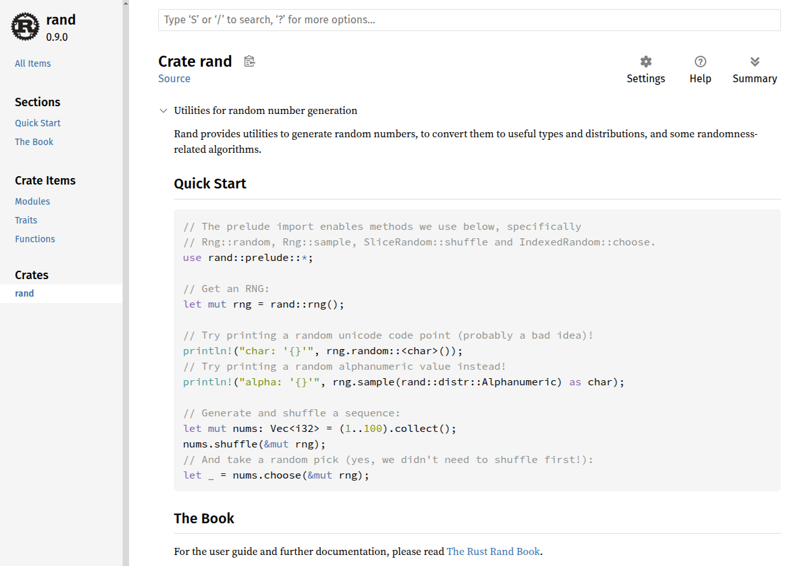
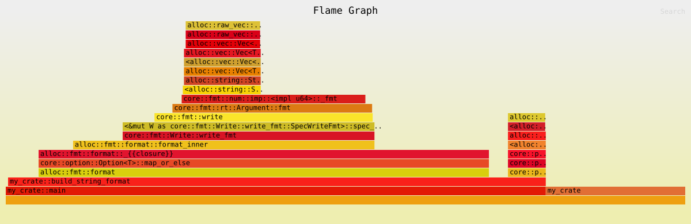
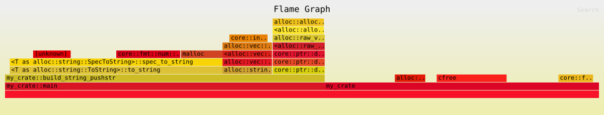

## Intro to Rust Lang

# The Rust Ecosystem

---

# Today: The Rust Ecosystem

- The Rust Toolchain: `rustup`, `clippy`, `rustfmt`, `rustdoc`
- Error handling crates: `anyhow` vs `thiserror`
- Performance and analysis: Criterion, Flamegraphs
- Kahoot!

---
layout: section
---

# **The Rust Toolchain**

---

# Toolchains

- A toolchain is a set of software tools used to build and develop software within a specific ecosystem
- A Rust toolchain is a complete installation of the Rust compiler (rustc) and related tools (like `cargo`)
  - Defined by release channel / version, and the host platform triplet
  - `stable-x86_64-pc-windows-msvc`, `beta-aarch64-unknown-linux-gnu`

---
layout: section
---

# **`rustup`**

---

# `rustup`

`rustup` is a _toolchain multiplexer_.

- Rust has several toolchains, which you manage via `rustup`
- `rustup` consolidates them as a single set of tools installed in `~/.cargo/bin`
- Similar to Ruby's `rbenv`, Python's `pyenv`, or Node's `nvm`

---

# The Rust Train

- New features follow the "train model" in three stages (channels):
    - Features start in **Nightly**.
    - Every six weeks, a release "leaves the station": the **Beta** branch is cut from `master`.
    - Still has to take a "journey" through the Beta channel before it "arrives" as a **Stable** release.

---

# Unstable Features

We can use features under development by enabling _unstable features_.

- You can only use unstable features on nightly
- Allows you to access cool new things in Rust
  - Example: [`try_blocks`](https://doc.rust-lang.org/beta/unstable-book/language-features/try-blocks.html) with `#![feature(try_blocks)]`
  - The `#![]` syntax defines a _feature flag_ and must be included at the top of the crate root.

<!--
Connor's PR to Rust :D https://github.com/rust-lang/rust/pull/128219
-->

---

# Selecting a Channel

Here are some basic commands to remember:

- `rustup update`
  - Updates your Rust toolchains to the latest versions.
- `rustup default set <stable/beta/nightly>`
  - Sets the default rust toolchain for all your projects.
- `rustup override set <stable/beta/nightly>`
  - Sets the default rust toolchain for the project only.
- `cargo +<stable/beta/nightly> build`
  - Uses a specific rust toolchain one-time.

---
layout: section
---

# **Clippy**

---

# Clippy

Clippy is a collection of lints that can catch common mistakes when writing Rust, improving the quality of your code.

- Already installed if using `rustup` (default profile)
- To run all lints, run `cargo clippy`
  - _Enforced in your homeworks!_
- To automatically apply suggestions, run `cargo clippy --fix`

<!--
When you initially install `rustup`, you should choose the default profile. If you don't want to, then you already know why you want a different profile...
-->

---

# Clippy Lint Levels

Clippy offers many different lint levels.

- `clippy::all`: all lints that are on by default
  - `clippy::correctness`: code that is outright wrong or useless
  - `clippy::suspicious`: code that is most likely wrong or useless
  - `clippy::style`: code that should be written in a more idiomatic way
  - `clippy::complexity`: code that does something simple in a complex way
  - `clippy::perf`: code that can be written to run faster
  - and more...
- Find all lints on [rust-lang.github.io/rust-clippy/master/](https://rust-lang.github.io/rust-clippy/master/)
- You can even make your own lints!

<!--
You don't have to know all of these things, we're just showing this so you know that there _are_ a lot of things!
-->

---

# Clippy Lint Levels

Set lint levels in attributes or in your `Cargo.toml`:
- `allow`, `warn`, `deny`
- `expect` (similar to `allow` except it warns when a lint does not fire)

```rust
#[allow(dead_code)]
fn old_function() {}

fn main() {
    #[expect(unused_variables, reason = "Will use x later")]
    let x = 42;
}
```

---
layout: section
---

# **`rustfmt`**

---

# `rustfmt`

`rustfmt` is a formatting tool that checks adherence to Rust's strict formatting standards.

- Already installed if using `rustup` (default profile)
- To format whole project: `cargo fmt`
- To only _check_ format: `cargo fmt -- --check`
  - _Enforced in your homeworks!_

<!--
It's pretty rare that you would use `rustfmt` by itself, usually you are running `cargo fmt` for everything.
-->

---

# Consistent Formatting

- The default Rust style is defined in the [Rust Style Guide](https://doc.rust-lang.org/style-guide/index.html)
- Format options are configurable with a `rustfmt.toml` file
  - But it is **strongly recommended** that developers use the default style
- Consistent formatting makes code more readable
  - Also makes it easier to collaborate with others

<!--
This is a subtle thing, but when jumping into an unknown codebase, having consistent formatting of code across every single Rust repository lowers the barrier to entry (much more than you probably think).

This is one of the reasons it is much easier to start contributing to a code base over something like a C or C++ codebase. When jumping into a C or C++ codebase, a significant fraction of the time there will be custom macros and/or templates that you have to learn before you can even understand the code. TLDR you are basically learning a new language every time you jump into a C/C++ codebase.
-->

---
layout: section
---

# **`rustdoc`**

---

# Rust Documentation

Reading the documentation of third-party libraries is super important!

- When we are unfamiliar with a tool, the first thing we need to do is read through documentation
- Rust's `rustdoc` tool provides a way for developers to write documentation consistently between packages
  - Create doc comments using three slashes `///`
  - Generate docs with `cargo doc` (already installed with `rustup`)
  - _All of our homework writeups were generated with `rustdoc`!_

---
class: image-full
---



---
layout: section
---

# **Error Handling**

---

# Error Handling

- In lecture 5, we talked about how to handle errors on your own
  - Hopefully you know what `Result<T, E>` is...
- Creating `MyError` types for `Result<T, MyError>` everywhere can create a lot of boilerplate and become cumbersome
- It is usually easier and faster to use a third-party library that can help you manage errors better!

---

# Error Handling Libraries

- `anyhow`
  - "I don't want to care about error types"
- `thiserror`
  - "I want to easily define errors for my library"

---

# `anyhow`

You can think about `anyhow` as a library that provides type-erased errors.

```rust
use anyhow::Result;

fn get_cluster_info() -> Result<ClusterMap> {
    let config = std::fs::read_to_string("cluster.json")?;
    let map: ClusterMap = serde_json::from_str(&config)?;
    Ok(map)
}
```

- Remember how painful it was to define a proper error type?
- `anyhow` provides `anyhow::Error`, a trait object based error type for easy idiomatic error handling in Rust applications
- Allows you to use `?` wherever you want (a better `Box<dyn Error>`)

<!--
Don't worry too much about the `serde_json`, basically it is a **deserializer** that can read in a structure like JSON and convert it into a proper rust struct (in this case, a `ClusterMap` - whatever that is)
-->

---

# `anyhow`: Attach context

You can add a `with_context` to attach a context to any errors.

```rust
use anyhow::{Context, Result};

fn main() -> Result<()> {
    // <-- snip -->
    it.detach().context("Failed to detach the important thing")?;

    let content = std::fs::read(path)
        .with_context(|| format!("Failed to read instrs from {}", path))?;
    // <-- snip -->
}
```

```
Error: Failed to read instrs from ./path/to/instrs.json
Caused by:
    No such file or directory (os error 2)
```

---

# `thiserror`

`thiserror` provides a single, convenient derive macro for the standard library’s `std::error::Error` trait.

```rust
use thiserror::Error;

#[derive(Error, Debug)]
pub enum DataStoreError {
    #[error("data store disconnected")]
    Disconnect(#[from] io::Error),
    #[error("the data for key `{0}` is not available")]
    Redaction(String),
    #[error("unknown data store error")]
    Unknown,
}
```

<!--
`thiserror` is literally just that single derive macro!
-->

---

# `thiserror`: Format Strings

```rust
#[derive(Error, Debug)]
pub enum Error {
    #[error("invalid rdo_lookahead_frames {0} (expected < {max})", max = i32::MAX)]
    InvalidLookahead(u32),
}
```

```rust
#[derive(Error, Debug)]
pub enum Error {
    #[error("first letter must be lowercase but was {:?}", first_char(.0))]
    WrongCase(String),

    #[error("invalid index {idx}, expected at least {} and at most {}",
                                                .limits.lo, .limits.hi)]
    OutOfBounds { idx: usize, limits: Limits },
}
```

<!--
These are just example use cases. `thiserror` is a relatively simple crate to use!
-->

---

# `thiserror`: To and `From`

You can use `thiserror` to unify different error types!

```rust
#[derive(Error, Debug)]
pub enum MyError {
    Io(#[from] io::Error),
    Glob(#[from] globset::Error),
}
```

```rust
#[derive(Error, Debug)]
pub struct MyError {
    msg: String,
    #[source]  // optional if field name is `source`
    source: anyhow::Error,
}
```

---

# Recap: [`anyhow`](https://docs.rs/anyhow/latest/anyhow/) vs [`thiserror`](https://docs.rs/thiserror/latest/thiserror/)

- Use `anyhow` in **binaries**
  - Good for type erasure and attaching dynamic context to errors
- Use `thiserror` in **libraries**
  - Good for creating error types

---
layout: section
---

# **Performance and Analysis**

---

# Performance Profiling

Recall the `goldbach` problem from **PrimerLab**.
- Compute $G(n)$, the number of ways an even integer $n$ can be expressed as the sum of two prime numbers

```rust
pub fn goldbach(n: u32) -> u32 {
    let mut count: u32 = 0;
    for i in 2..n {
        for j in 2..n {
            if is_prime(i) && is_prime(j) && i + j == n {
                count += 1;
            }
        }
    }
    count.div_ceil(2)
}
```

---

# Performance Profiling: Timer

A naive solution is to just use a timer!

```rust
use std::time::Instant;
use std::hint::black_box;

fn main() {
    let start_time = Instant::now();

    let _ = black_box(goldbach(10000));

    let elapsed = start_time.elapsed();
    println!("Elapsed: {:.2?}", elapsed);
}
```

```
Elapsed: 14.00ms
```

---

# Problem: Statistical Significance

When we run this code multiple times, we could get different results...

```
Elapsed: 14.30ms
Elapsed: 11.59ms
Elapsed: 8.48ms
Elapsed: 10.35ms
Elapsed: 20.95ms
```

- How do we control our environment?
  - Compiler optimizations can skew results, the OS scheduler and other noise can create performance variations
  - Seeing a number go up/down is one thing, whether it's statistically significant is another

<!--
This is an overexaggeration, we ran other things at the same time on the same computer to make these
numbers vary wildly.
-->

---
layout: section
---

# **Criterion**

---

# Criterion

Criterion is a statistics-driven micro-benchmarking library written in Rust.

- Collects detailed statistics, providing strong confidence that changes to performance are real, not measurement noise
- Produces detailed charts and provides thorough understanding of your code’s performance behavior
- Read the [library docs](https://docs.rs/criterion/latest/criterion/) and [user guide](https://bheisler.github.io/criterion.rs/book/index.html)!

---

# `criterion`

Add `criterion` as a development dependency:

```toml
[dev-dependencies]
criterion = "0.5.0"

[[bench]]
name = "my_benchmark"
harness = false
```

- `name = "my_benchmark"` declares that there is a benchmark file located at `my_crate/benches/my_benchmark.rs` (not in `src/` directory)

<!--
Don't worry too much about the `harness = false`.
-->

---

# Example: Simple `criterion` Benchmark

Create a benchmark file at `my_crate/benches/my_benchmark.rs`.

```rust
use criterion::{black_box, criterion_group, criterion_main, Criterion};
use my_crate::goldbach;

pub fn criterion_benchmark(c: &mut Criterion) {
    c.bench_function("goldbach 10000", |b| b.iter(|| goldbach(black_box(10000))));
}

criterion_group!(benches, criterion_benchmark);
criterion_main!(benches);
```

- Import `criterion` items
- Import the function we want to bench (in this case, `my_crate::goldbach`)
- Create a benchmark using the `Criterion` object

<!--
Note we import the crate because we consider our crate an external crate when writing things like benchmarks and integration tests we're benchmarking as an external crate.
This is because Cargo compiles each benchmark under `/benches` as if each was a separate crate from the main crate

If you are interested in how exactly those two macros at the bottom work, go read the documentation!
-->

---

# Example: Simple `criterion` Benchmark

```rust
// <-- snip -->

pub fn criterion_benchmark(c: &mut Criterion) {
    c.bench_function("goldbach 10000", |b| b.iter(|| goldbach(black_box(10000))));
}                                                          // ^^^^^^^^^^^^^^^^

// <-- snip -->
```

- `black_box` stops the compiler from optimizing away our entire function
  - Otherwise it could replace `goldbach(10000)` with a constant

---

# `criterion`

Run the benchmark with `cargo bench`:

```ansi
$ cargo bench
<-- snip -->
Benchmarking goldbach 10000: Analyzing
goldbach 10000                  time:   [25.748 µs 26.515 µs 27.506 µs]
Found 16 outliers among 100 measurements (16.00%)
  2 (2.00%) high mild
  14 (14.00%) high severe
```

<!--
Some details omitted.
-->

---

# Goldbach Improvements

Our solution could definitely be improved...

```rust
pub fn goldbach(n: u32) -> u32 {
    let mut count: u32 = 0;
    for i in 2..n {
        for j in 2..n {
            if is_prime(i) && is_prime(j) && i + j == n {
                count += 1;
            }
        }
    }
    count.div_ceil(2)
}
```

- This requires $O(n^2 \sqrt{n})$ work

---

# Goldbach Improvements

Let's write a second version for comparison:

```rust
pub fn goldbach(n: u32) -> u32 {
    let mut count = 0;
    for i in 2..=(n / 2) {
        if is_prime(i) && is_prime(n - i) {
            count += 1;
        }
    }
    count
}
```

- Theoretically we have gone from $O(n^2 \sqrt{n})$ to $O(n \sqrt{n})$ work!

<!--
This is from our homework solutions!
-->

---

# Goldbach Improvements

Upon rerunning `cargo bench`, `criterion` compares it with our previous run:

```ansi
$ cargo bench
<-- snip -->
Benchmarking goldbach 10000: Analyzing
goldbach 10000                  time:   [9.8414 ns 9.9367 ns 10.043 ns]
                        change: [-99.968% -99.966% -99.964%] (p = 0.00 < 0.05)
                        Performance has improved.
Found 4 outliers among 100 measurements (4.00%)
  3 (3.00%) high mild
  1 (1.00%) high severe
```

- `change: [-99.968% -99.966% -99.964%] (p = 0.00 < 0.05)`
  - This is a statistically significant improvement!

<!--
Some details omitted.
-->

---
layout: section
---

# **Flamegraphs**

---

# Flamegraphs

Suppose you want to know _where_ your program is spending time.

- We want to know which functions take the most time
- We could add timers for every single function call
  - Manually adding timers is error-prone, misses deeper call stacks
- That's why we have `flamegraph`s!

---

# Example: Concatenating Strings

Suppose we have the following function, and we want to know where most of the time is spent:

```rust
fn build_string(n: usize) -> String {
    let mut s = String::new();
    for i in 0..n {
        s += &format!("{i}");
    }
    s
}

build_string(5); // produces "01234"
build_string(15); // produces "01234567891011121314"
```

---

# Flamegraph

We can generate flamegraphs for our code with `cargo flamegraph`:



---

# Flamegraph Analysis


- Flamegraphs are generated by _sampling_ the call stack many times
- Flamgegraphs display the call stack from bottom to top
  - The width of a block is the relative time spent in that function

---

# Flamegraph Usage

It's more informative to have a side-by-side comparison:

```rust
fn build_string_format(n: usize) -> String {
    let mut s = String::new();
    for i in 0..n {
        s += &format!("{i}");
    }
    s
}

fn build_string_pushstr(n: usize) -> String {
    let mut s = String::with_capacity(n * 2);
    for i in 0..n {
        s.push_str(&i.to_string());
    }
    s
}
```

<!--
Make sure students understand the differences and similarities between the two functions
-->

---

# Flamegraph

Here is the flamegraph for `build_string_format`:


<!--
Note that these were generated with `cargo flamegraph --skip-after my_crate::main --min-width 5`.
This basically chops off a bunch of stuff below `main` and tidies up the graph.
Also, the function was called 1000000 times to get better readings. If you only run it once, it is
likely that the sampling doesn't get enough information.
-->

---

# Flamegraph

Here is the flamegraph for `build_string_pushstr`:



<!--
KEY OBSERVATIONS:
- format! approach has wider + more blocks dedicated to memory allocation and string formatting operations
    `alloc::raw_vec::RawVecInner`, `alloc::string::String`, `core::fmt`
    - markedly taller call chain than push_str, more time spent in overhead functions than main algorithm
- push_str shows fewer allocations and less time spent in string manipulation operations
    - narrower sections for memory operations because pre-allocation
        reduces the number of reallocations needed
    - more time in the main algorithm, as opposed to overhead functions
-->

---
layout: section
---

# **Kahoot!**

---

# Midsemester Grades

- **The late deadline for homework is October 18, 2026 11:59 PM ET**
  - We have to submit midsemester grades after the break!
  - So we CANNOT accept submissions past this point
- Midsemester grade cutoffs
  - P or S $\ \ge 450$
  - R $\qquad < 450$
- Talk to us ASAP if this is a concern
  - We may email and/or track you down if you're not passing 🫵

---

# Sneak Peek: Choose a Track

- After the break, you can choose to do ONE of these for credit:
  - **Track A:** Traditional guided labs (like what you've done so far)
  - **Track B:** Student-defined project
- If you're interested in Track B, start brainstorming some ideas!
- More info will be posted later

---
layout: section
---

# Enjoy your break!!!

---
layout: none
---

<EndingSlide next-lecture="Closures and Iterators" />
